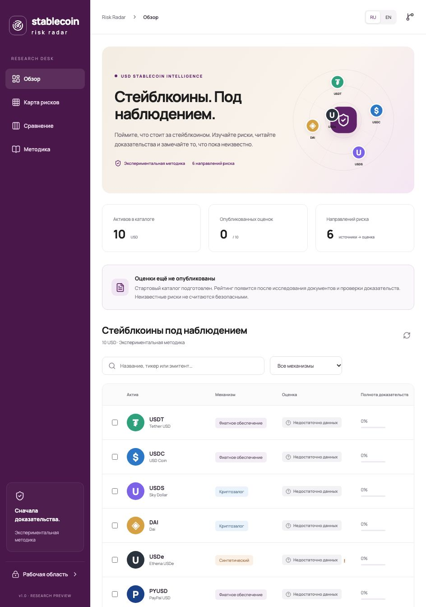

# Stablecoin Risk Radar

Public RU/EN research dashboard: catalog, evidence coverage, six-dimensional heatmap, comparisons, source excerpts and assessment history. Initial assets: USDT, USDC, USDS, DAI, USDe, PYUSD, RLUSD, USD1, USDG and USDD.

The catalog starts **without published risk scores**.

 Market data are observed DeFiLlama values; they do not establish safety. Ratings become available only after source extraction, verification and owner review. A score of 100 represents criterion fulfillment, not a guarantee or probability of safety. Methodology 1.1 is experimental and requires manual validation on the initial ten assets.

## Architecture

React + TypeScript + Vite on GitHub Pages. Cloudflare Workers serves the API, D1 stores facts, assessment versions and jobs, private R2 stores documents. GitHub OAuth grants owner-only access, checked against numeric GitHub ID on every administrative request. Upstash Workflow/QStash handles resumable research. D1 FTS5 retrieves source facts for the private RAG chat; Jev checks citation support. This first version does not use vector embeddings. It does not use the owner's existing Supabase projects or BrainBox Vector index.

OpenRouter uses `deepseek/deepseek-v4.1-flash` with `coreweave/fp8` first and `together` fallback; all other providers are excluded. Exa search runs through the OpenRouter web plugin. Tavily extracts approved source URLs. Jev verifies narrow claims; TypeScript calculates the rating. Source-discovery output is kept private and must be approved before a URL enters the extraction allowlist.

## Development

```sh
npm ci
cp .env.example .env.local
npm run dev
npm test
npm run build
npx tsc -p tsconfig.worker.json
npm run check:secrets
```

Set `VITE_API_URL` to the Worker URL; it is public configuration. Without it the client displays the catalog and a dated market snapshot. Vite base path is `/stablecoin-risk-radar/`. No server credential belongs in a `VITE_*` variable.

```sh
npx wrangler d1 migrations apply stablecoin-risk-radar --local
npx wrangler dev
```

## Deployment

GitHub Actions validates and publishes the frontend. Worker deployments are deliberately separate:

```sh
npx wrangler d1 migrations apply stablecoin-risk-radar --remote
npx wrangler deploy
npx wrangler secret put GITHUB_CLIENT_ID
npx wrangler secret put GITHUB_CLIENT_SECRET
npx wrangler secret put OPENROUTER_API_KEY
npx wrangler secret put TYPESAFE_API_KEY
npx wrangler secret put TAVILY_API_KEY
npx wrangler secret put QSTASH_TOKEN
npx wrangler secret put QSTASH_CURRENT_SIGNING_KEY
npx wrangler secret put QSTASH_NEXT_SIGNING_KEY
```

OAuth homepage: `https://raydo-max.github.io/stablecoin-risk-radar/`. Callback: `https://stablecoin-risk-radar-api.krimart.workers.dev/auth/callback`. OAuth requests no repository permissions. The server checks GitHub ID `287957837`. One-day application sessions are stored hashed in D1; browser tokens live in sessionStorage and are removed from the callback fragment immediately. The R2 bucket has no public endpoint.

## Rating and budget policy

Weights: backing 25%, redemption 20%, technology 20%, governance 15%, market 10%, transparency 10%. Each dimension has four explicit criteria in `worker/methodology.ts`. Evidence must resolve every criterion for a dimension to have a score; unresolved dimensions remain unknown. Exact source excerpts and narrow Jev judgments are retained, including adverse evidence. Attestations, financial audits, code audits, terms and whitepapers are distinct. Contract audit correspondence requires an independently recorded chain/contract; discovering a chain does not verify a token or bridge. No aggregate with missing or expired mandatory evidence, contradictions or critical events.

Monthly budget defaults to **$5**; paid automation defaults off. Each paid step reserves a conservative ceiling atomically before dispatch. Failed and uncertain calls keep their reservations. Paid API calls have zero transport retries; retrying a failed job is a new budgeted operation. Orchestration retries reuse persisted steps. Known usage is recorded separately, but the ceiling remains charged against the monthly cap. Provider caps, response sizes, source count, output tokens and document storage are bounded. The cap does not cover unrelated usage of these accounts.

Refresh profiles: economy 24h/7d/7d, balanced 1h/24h/7d, intensive 15m/6h/24h for market/documents/search. A 15-minute Worker cron dispatches due tasks; batching avoids one market request per coin. Documents are versioned by content hash. New coins, methodology changes, contradictions and changes of at least five points require owner review. Last published data remain available on failure, with evidence dates visible. Confirmed critical events suppress aggregate ratings immediately; model-suspected events only flag review.

## Launch status and operations

See [docs/RUNBOOK.md](docs/RUNBOOK.md) for credentials, data recovery and launch checks. Hosting and database resources use free tiers; no automatic upgrade is configured. Jev thresholds are provisional policy values, not measured accuracy. Hosted owner OAuth and the live USDC research pipeline were verified on 2026-10-05. Initial manual validation and a positive RAG citation check remain separate launch gates; the insufficient-evidence refusal was verified. PDF OCR is not performed in Workers. Unreadable documents create no confirmed facts. Sources larger than the archival limit are flagged for processing. Private document archives and usage metadata are excluded from public endpoints.

## Verification calibration

Experimental method 1.1 separates source support, reporting-date scope, document type and criterion fulfillment. Each probability must pass 0.9; code additionally rejects invented dates, quote/asset mismatches and unrecorded contract audits. A source-backed fact does not automatically satisfy a multi-part risk criterion. See [source review](docs/SOURCE_REVIEW.md) and [live regression benchmark](docs/calibration-results.json).
